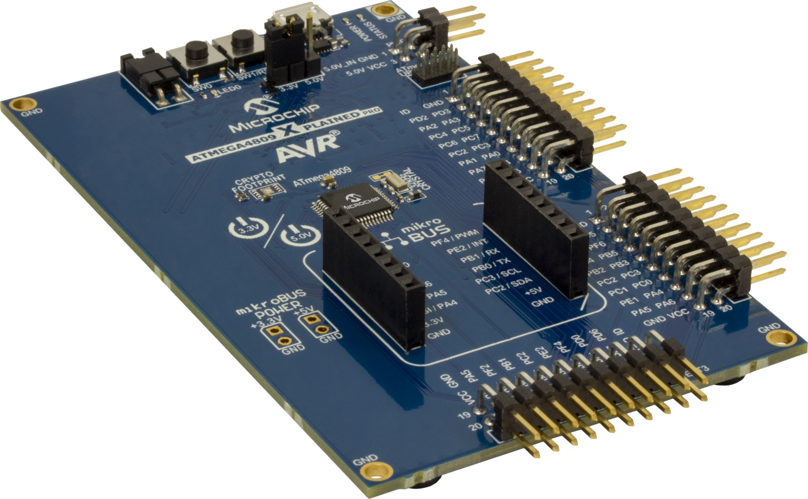
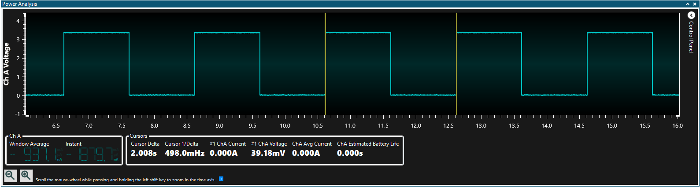

 # Using TCB in Sleep Mode

This program shows how to configure the Timer/Counter Type B (TCB) to operate in sleep mode. The TCB0 is configured to generate an overflow interrupt every second. The interrupt wakes up the device and toggles an LED.

## Related Documentation
More details and code examples on the ATMEGA4809 can be found at the following links:
- [TB3214 - Getting Started with Timer/Counter Type B (TCB)](https://ww1.microchip.com/downloads/en/Appnotes/TB3214-Getting-Started-with-TCB-DS90003214.pdf)
- [ATMEGA4809 Product Page](https://www.microchip.com/wwwproducts/en/ATMEGA4809)
- [ATMEGA4809 Code Examples on GitHub](https://github.com/microchip-pic-avr-examples?q=atmega4809)
- [ATMEGA4809 Project Examples in START](https://start.atmel.com/#examples/ATMEGA4809XplainedPro)

## Software Used
- Microchip Studio 7.0.2542 or newer [(https://www.microchip.com/mplab/microchip-studio)](https://www.microchip.com/mplab/microchip-studio)
- ATmega_DFP 1.6.364 or newer Device Pack

## Hardware Used
- ATMEGA4809 Xplained Pro [(ATMEGA4809-XPRO)](https://www.microchip.com/developmenttools/ProductDetails/ATMEGA4809-XPRO)

## Setup
The ATMEGA4809 Xplained Pro Development Board is used as test platform.

 

The following configurations must be made for this project:

<Configurations>

System clock is set to Internal 32 kHz Ultra Low-Power Oscillator and the prescaler is off.

TCB0:
- Clock Selection: Main clock divided by 1
- Period in CCMP register set to 0x7FFF
- TCB mode is in Periodic Interrupt mode
- Capture or time-out interrupt enabled
- Run in Standby enabled

Sleep is enabled and set to Standby mode.

Pin PB5 is configured as output having the initial state high (for the LED to start off).

| Pin |  Configuration    |
| :-: | :---------------: |
| PB5 |   Digital output  |

 ## Operation
 1. Connect the board to the PC.

 2. Open the **atmega4809-getting-started-with-tcb-studio.atsln** solution in Microchip Studio.

 3. Set the **Using_TCB_in_Sleep_Mode** project as Start-Up project. Right click on the project in the **Solution Explorer** tab and click **Set as StartUp Project**.

 

 4. Build the **Using_TCB_in_Sleep_Mode** project: Right click on the **atmega4809-getting-started-with-tcb-studio** solution and select **Build Solution**.

 

 5. Select the **ATMEGA4809 Xplained Pro** in the Connected Hardware Tool section of the project settings:
   - Right click on the project and click **Properties**
   - Click on the **Tool** tab
   - Select the **ATMEGA4809 Xplained Pro** (click on the **SN**) in the Selected debugger/programmer section, and save (CTRL + S):

 

 6. Program the project to the board: Click on the **Debug** tab and click **Start Without Debugging**.

 

## Demo

 

This image shows the LED pin toggling every second. The core exits the sleep mode, toggles the LED, and enters the sleep mode once again.

## Summary

This code example shows how to configure the TCB to provide an interrupt every second to wake up the microcontroller from Standby Sleep mode and toggle an LED.
