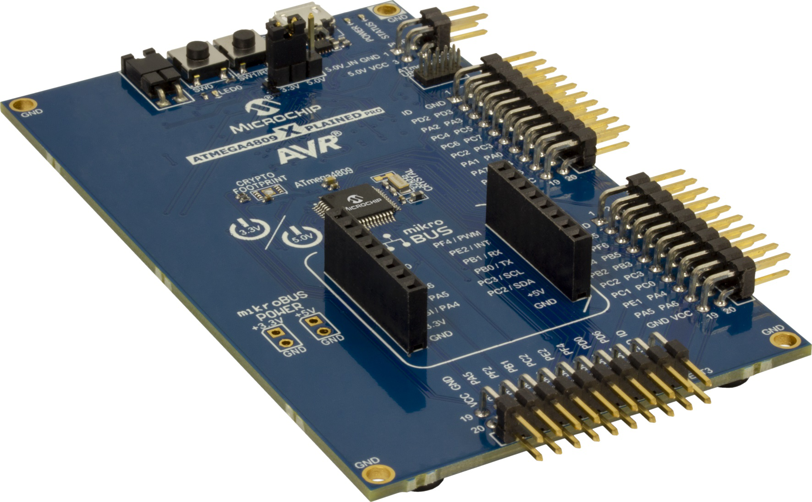
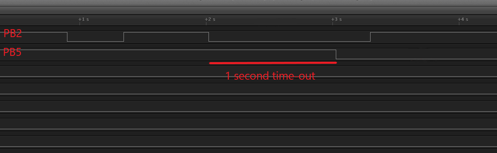

 # Using TCB in Time-out Check Mode

This program shows how to configure the Timer/Counter Type B (TCB) in Time-out Check mode and measure the signal time generated by a GPIO. The time-out will be set to one second. If the time-out period is reached, the on board LED will toggle.  

## Related Documentation
More details and code examples on the ATMEGA4809 can be found at the following links:
- [TB3214 - Getting Started with Timer/Counter Type B (TCB)](https://ww1.microchip.com/downloads/en/Appnotes/TB3214-Getting-Started-with-TCB-DS90003214.pdf)
- [ATMEGA4809 Product Page](https://www.microchip.com/wwwproducts/en/ATMEGA4809)
- [ATMEGA4809 Code Examples on GitHub](https://github.com/microchip-pic-avr-examples?q=atmega4809)
- [ATMEGA4809 Project Examples in START](https://start.atmel.com/#examples/ATMEGA4809XplainedPro)

## Software Used
- Microchip Studio 7.0.2542 or newer [(https://www.microchip.com/mplab/microchip-studio)](https://www.microchip.com/mplab/microchip-studio)
- ATmega_DFP 1.6.364 or newer Device Pack

## Hardware Used
- ATMEGA4809 Xplained Pro [(ATMEGA4809-XPRO)](https://www.microchip.com/developmenttools/ProductDetails/ATMEGA4809-XPRO)

## Setup
The ATMEGA4809 Xplained Pro Development Board is used as test platform.

 

The following configurations must be made for this project:

<Configurations>

System clock is set to Internal 32kHz Ultra Low-Power Oscillator and the prescaler is off. 

TCB0:
- Clock Selection: Main clock divided by 1
- Time-out in CCMP register set to 0x7FFF
- TCB mode is set to Periodic Time-out mode
- Capture or time-out interrupt enabled
- Event input for capture is enabled and the Edge bit is set

Event System
- Pin PB2 as event generator on channel 0
- Event user TCB0 capture set to channel 0

Pin PB5 is configured as output having the initial state high (for the LED to start off) and pin PB2 is configured as input with pull up.

| Pin |  Configuration    |
| :-: | :---------------: |
| PB5 |   Digital output  |
| PB2 |   Digital input   |

 ## Operation
 1. Connect the board to the PC.

 2. Open the **atmega4809-getting-started-with-tcb-studio.atsln** solution in Microchip Studio.

 3. Set the **Using_TCB_in_Time-out_Check_Mode** project as Start-Up project. Right click on the project in the **Solution Explorer** tab and click **Set as StartUp Project**.

 

 4. Build the **Using_TCB_in_Time-out_Check_Mode** project: Right click on the **atmega4809-getting-started-with-tcb-studio** solution and select **Build Solution**.

 

 5. Select the **ATMEGA4809 Xplained Pro** in the Connected Hardware Tool section of the project settings:
   - Right click on the project and click **Properties**
   - Click on the **Tool** tab
   - Select the **ATMEGA4809 Xplained Pro** (click on the **SN**) in the Selected debugger/programmer section, and save (CTRL + S):

 

 6. Program the project to the board: Click on the **Debug** tab and click **Start Without Debugging**.

 

## Demo

 

This image shows the input signal on pin PB2 on the first line and the signal on the LED on the second line. Note that the LED signal toggles after the first signal was longer than a second.

## Summary

This program shows how to configure the TCB in Time-out Check mode and measure the signal time generated by a GPIO pin.